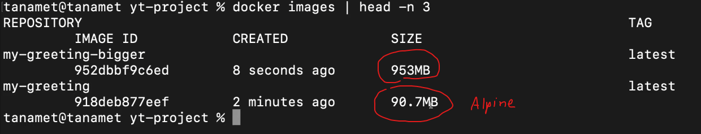

# Docker-Tutorial

This is a Documentation Docker

## files:
- docker
- .dockerignore
  - node_modules
  - package-lock.json

## node vs node:alpine size



## Command:
### Outside
- list containers:```docker ps```
- list all containers: ```docker ps -a```
- list images: ```docker images```
- delete image: ```docker rmi [image name]```
- login: ```docker login```
- start: ```docker start [container name]```
- stop: ```docker stop [container name]```
- get in container: ```docker exec -it [container name] bash```
### Inside
- exit: ```exit```
## More Detail:
### General
  - General: [Docker in 100 Seconds](https://www.youtube.com/watch?v=Gjnup-PuquQ&ab_channel=Fireship)
  - Architecture: [you need to learn Docker RIGHT NOW!! // Docker Containers 101](https://www.youtube.com/watch?v=eGz9DS-aIeY&ab_channel=NetworkChuck)
  - Know when into env: [สอนใช้ Docker แบบค่ดเร็ว](https://www.youtube.com/watch?v=8TSvoTp3Lyo&ab_channel=Techcast)
### Angular-Docker
  - Easy to use: [Create Angular App and Deploy it to Docker Hub](https://www.youtube.com/watch?v=etA5xiX5TCA&ab_channel=freeCodeCamp.org)
  - Note Detail of command: [Docker with an Angular Application](https://www.youtube.com/watch?v=MbA71IuYUhg&ab_channel=JakeCyr)