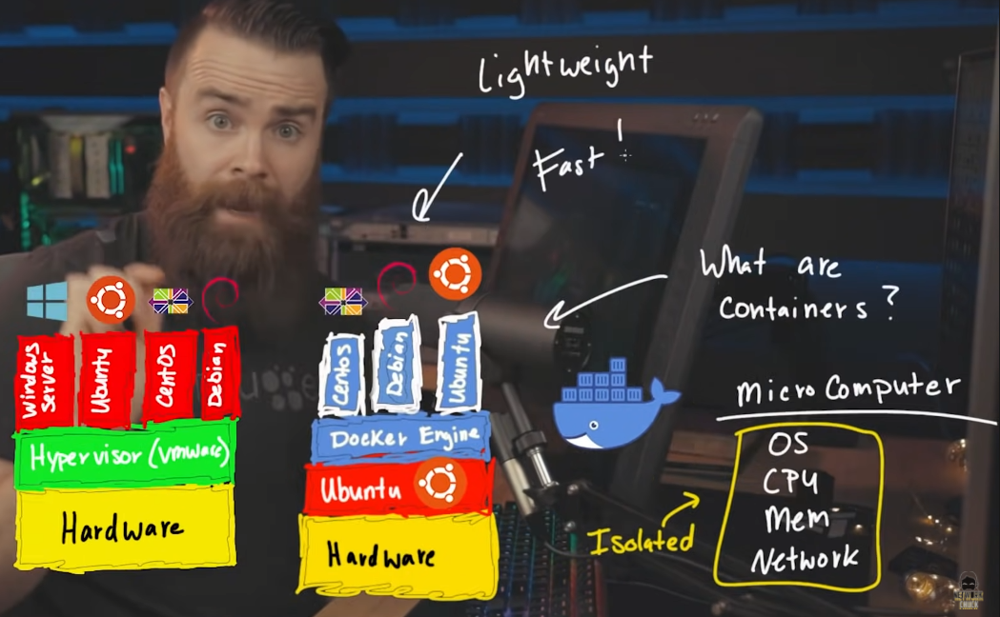
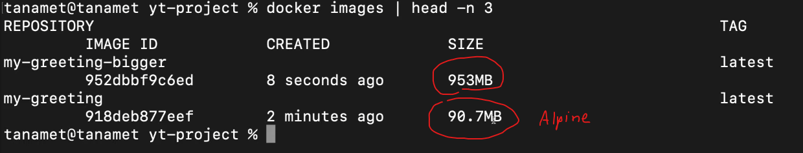

# Docker-Tutorial

This is a Documentation Docker

## Overview architecture


## files
- Dockerfile
- .dockerignore
  - node_modules
  - package-lock.json
- docker-compose.yml (run many container at once)

## node vs node:alpine size



## Command
### Dockerfile
- FROM: import image
- COPY: ```[host path] [docker path]```
- WORKDIR: default directory in docker container
- RUN: only run when "build" an image first time
- CMD: run every time when "start" a container
### General
- version: ```docker version```
### Images
- list images: ```docker images```
- build image: ```docker build -t [image name:tag] [Dockerfile path]```
- delete image: ```docker rmi [image name:tag]```
- change image name: ```docker tag [image name:tag] [new image name:tag]```
### Containers
- list containers: ```docker ps```
- list all containers: ```docker ps -a```
- create container: ```docker run -t -d --name [container name] [image name:tag]```
- create container(w/ port): ```docker run -t -d -p [host port:docker port] --name [container name] [image name:tag]```
- start container: ```docker start [container name]```
- stop container: ```docker stop [container name]```
- remove container (forever): ```docker rm [container name]```
- get in container: ```docker exec -it [container name] {bash, sh}```
- status: ```docker stats```
#### *note: { } mean "use any members of set"
### Hub.docker.com
- login: ```docker login```
- push: ```docker push [username/image name:tag]```
- pull image: ```docker pull [image name:tag]```
### docker-compose.yml
- run all: ```docker-compose up```
- shutdown: ```docker-compose down```

### Others
- find IP: ```docker inspect [container name] | grep IP```

## More Detail
### General
  - General: [Docker in 100 Seconds](https://www.youtube.com/watch?v=Gjnup-PuquQ&ab_channel=Fireship)
  - Architecture: [you need to learn Docker RIGHT NOW!! // Docker Containers 101](https://www.youtube.com/watch?v=eGz9DS-aIeY&ab_channel=NetworkChuck)
  - Overview: [What is Docker in 5 minutes](https://www.youtube.com/watch?v=_dfLOzuIg2o&ab_channel=TechSquidTV)
  - Know when into env: [สอนใช้ Docker แบบค่ดเร็ว](https://www.youtube.com/watch?v=8TSvoTp3Lyo&ab_channel=Techcast)
  - Instruction Step by step: [Docker Tutorial for Beginners [2021]](https://www.youtube.com/watch?v=pTFZFxd4hOI&ab_channel=ProgrammingwithMosh)
  - Like above in 11 mins: [Learn Docker in 7 Easy Steps - Full Beginner's Tutorial](https://www.youtube.com/watch?v=gAkwW2tuIqE&ab_channel=Fireship)
  - Detail: [Docker สำหรับผู้เริ่มต้น:EP.6 Dockerfile คืออะไร และใช้งานอย่างไร](https://www.youtube.com/watch?v=IW11V1ZRSbI&ab_channel=Born2LearnTH)
### Angular-Docker
  - Easy to use: [Create Angular App and Deploy it to Docker Hub](https://www.youtube.com/watch?v=etA5xiX5TCA&ab_channel=freeCodeCamp.org)
  - Note Detail of command: [Docker with an Angular Application](https://www.youtube.com/watch?v=MbA71IuYUhg&ab_channel=JakeCyr)